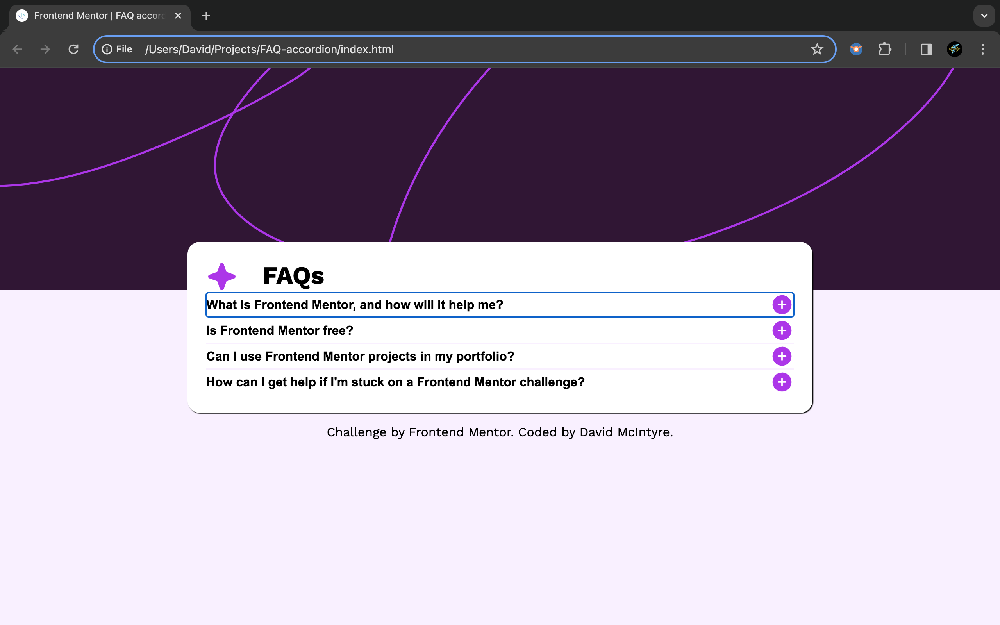

# Frontend Mentor - FAQ accordion solution

This is a solution to the [FAQ accordion challenge on Frontend Mentor](https://www.frontendmentor.io/challenges/faq-accordion-wyfFdeBwBz). Frontend Mentor challenges help you improve your coding skills by building realistic projects. 

## Table of contents

- [Overview](#overview)
  - [The challenge](#the-challenge)
  - [Screenshot](#screenshot)
  - [Links](#links)
  - [Built with](#built-with)
  - [What I learned](#what-i-learned)
- [Author](#author)

## Overview

### The challenge

Users should be able to:

- Hide/Show the answer to a question when the question is clicked
- Navigate the questions and hide/show answers using keyboard navigation alone
- View the optimal layout for the interface depending on their device's screen size
- See hover and focus states for all interactive elements on the page

### Screenshot

### Links

- Solution URL: [My Solution](https://github.com/davidrmcintyre/faq-accordion)
- Live Site URL: [Live site](https://davidrmcintyre.github.io/faq-accordion/)

### Built with

- Semantic HTML5 markup
- CSS custom properties
- Flexbox
- CSS Grid
- Mobile-first workflow
- Vanilla JavaScript

### What I learned

I enjoyed this challenge, it was nice using Vanilla JS to achieve the desired result. It was useful practice in using event listeners and manipulating the DOM.

## Author

- Website - [David McIntyre](https://davidrmcintyre.github.io/portfolio/)
- Frontend Mentor - [@davidrmcintyre](https://www.frontendmentor.io/profile/davidrmcintyre)
- Twitter - [@davidrobertmci](https://twitter.com/davidrobertmci)

